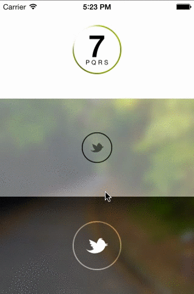

> Many thanks to **[@ZevEisenberg](https://github.com/ZevEisenberg)**

MRoundedButton
==============

MRoundedButton is a subclass of UIControl and the appearance is like the iOS 7 **Phone** app button or the button on the **Control Center** and also perform fade in/out animation for touch event.

Four button styles are suplied:

    MRoundedButtonDefault           //  central text
    MRoundedButtonSubtitle          //  text with subtitle 
    MRoundedButtonCentralImage      //  central image
    MRoundedButtonImageWithSubtitle //  image with subtitle

To set a transparent border:
    
    MRoundedButton *button = [[MRoundedButton alloc] initWithFrame:#<BUTTON_FRAME>
                                                       buttonStyle:#<BUTTON_STYLE>];
    button.borderWidth = 2;
    button.borderColor = [UIColor clearColor];

The value of `borderWidth` and `cornerRadius` are limited to `MIN(BUTTON_WIDTH / 2, BUTTON_HEIGHT / 2)`. 
Setting the `cornerRadius` to `FLT_MAX` or `MRoundedButtonMaxValue` can easily make a round button.

CocoaPods
=========

    platform :ios, '6.0'
    pod "MRoundedButton", "~> 1.0"

> The 1.1 version is not CocoaPods ready, can download it from [here](https://github.com/mrcrow/MRoundedButton/releases)

MRoundedButtonAppearanceManager
===============================

MRoundedButtonAppearanceManager is the appearance manager for MRoundedButton, each appearance information can be stored in a [NSDictionary](https://developer.apple.com/library/ios/documentation/Cocoa/Reference/Foundation/Classes/NSDictionary_Class/Reference/Reference.html) object to make it reusable in the whole project:

    NSDictionary *appearanceProxy = @{kMRoundedButtonCornerRadius : @40,
                                      kMRoundedButtonBorderWidth  : @2,
                                      kMRoundedButtonBorderColor  : [UIColor clearColor],
                                      kMRoundedButtonContentColor : [UIColor blackColor],
                                      kMRoundedButtonContentAnimationColor : [UIColor whiteColor],
                                      kMRoundedButtonForegroundColor : [UIColor whiteColor],
                                      kMRoundedButtonForegroundAnimationColor : [UIColor clearColor]};
    [MRoundedButtonAppearanceManager registerAppearanceProxy:appearanceProxy1 forIdentifier:#<UNIQUE_IDENTIFIER>];
    
MRHollowBackgroundView
============

MRHollowBackgroundView can be used to place the MRoundedButton on an image view or something.
> In the drawRect: method, each `subview` of HRHollowView will be cliped to its bounds by `CGContextEOFillPath()`. Then the superview can be displayed from the hollowed shapes.

Requirement
===========
* iOS 6.0+

Release Notes
==============
* Ver 1.0
  - First Commit
* Ver 1.1
  - Make it easy to hightlight the button via `setSelected:`
  - Add disabled appearance when set `enabled` to `NO`, need to be improved
  - Changed some properties name to make it easy to be understood
  - Fixed `userInteractionEnabled` issue

TODO
====
* Disable appearance
    
License
=======
> Permission is hereby granted, free of charge, to any person obtaining a copy
> of this software and associated documentation files (the "Software"), to deal
> in the Software without restriction, including without limitation the rights
> to use, copy, modify, merge, publish, distribute, sublicense, and/or sell
> copies of the Software, and to permit persons to whom the Software is
> furnished to do so, subject to the following conditions:
>
> The above copyright notice and this permission notice shall be included in
> all copies or substantial portions of the Software.
>        
> THE SOFTWARE IS PROVIDED "AS IS", WITHOUT WARRANTY OF ANY KIND, EXPRESS OR
> IMPLIED, INCLUDING BUT NOT LIMITED TO THE WARRANTIES OF MERCHANTABILITY,
> FITNESS FOR A PARTICULAR PURPOSE AND NONINFRINGEMENT. IN NO EVENT SHALL THE
> AUTHORS OR COPYRIGHT HOLDERS BE LIABLE FOR ANY CLAIM, DAMAGES OR OTHER
> LIABILITY, WHETHER IN AN ACTION OF CONTRACT, TORT OR OTHERWISE, ARISING FROM,
> OUT OF OR IN CONNECTION WITH THE SOFTWARE OR THE USE OR OTHER DEALINGS IN
> THE SOFTWARE.
        
